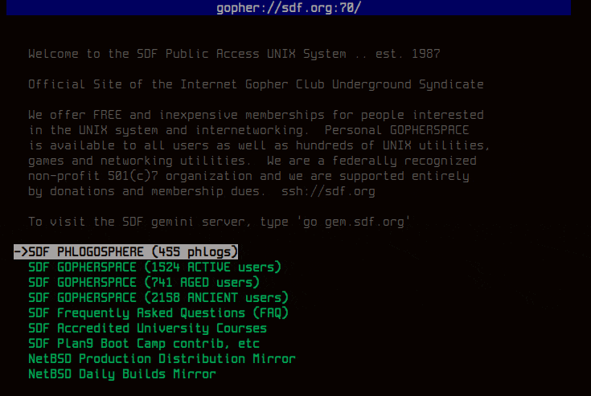

# Tocaia  

Tocaia is a simple and portable **Gopher** client built with **C89** and **POSIX** in mind. 
It offers a **TUI** interface to explore Gopherspace, with support for menus, text files, searches, and back/forward navigation.

<p align="center">
  
</p>

## Features  
- Menu and text file browsing  
- Search queries  
- Back/forward navigation history  
- Cross-platform support (Unix-like systems)  
- Minimal dependencies  

### Dependencies  
- C compiler (GCC or Clang)  

### Installation  

```sh
git clone https://github.com/manipuladordedados/tocaia.git
cd tocaia
makeTocaia is a simple and portable Gopher client built with C89 and POSIX in mind. It offers a TUI interface to explore Gopherspace, with support for menus, text files, searches, and back/forward navigation.
